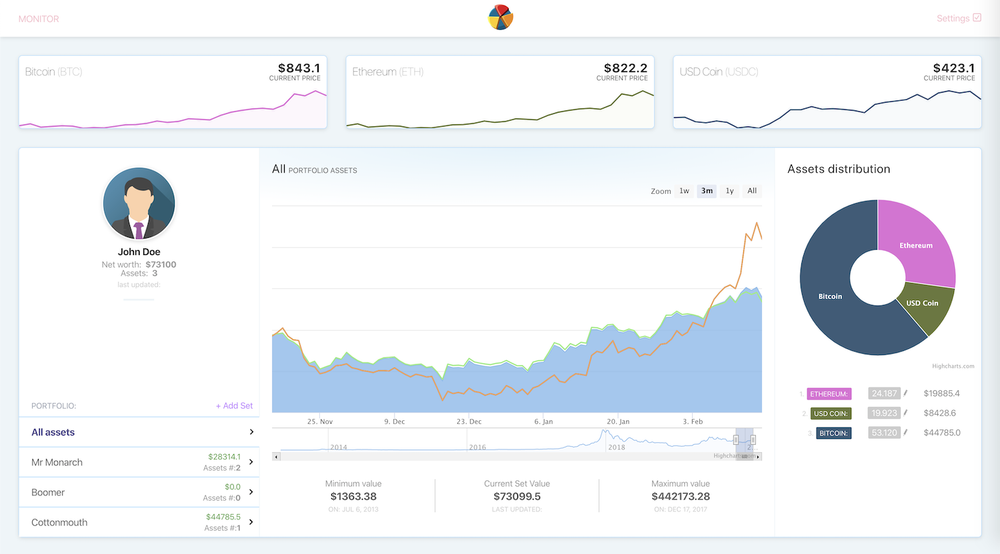

# Crypto Currency Monitor

A comprehensive dashboard to track all your crypto investments and savings. <br/>
Overtime performance and current state of affairs.  
>*Link to a [demo](http://199.244.50.247:8080/)*



## Getting Started

The project is made to showcase React-Redux application `/client` in combination with <br/>headless Ruby on Rails application `/server` as API. <br/>
All dockerized and orchestrated with docker compose for effortless infrastructure management.<br/>
API also integrates with [coinmarketcap](https://coinmarketcap.com/) to get the latest updates about asset values.

### Prerequisites

>To get up an running you need this to be installed on your machine:
* [Docker](https://www.docker.com/)
* [git](https://git-scm.com/)

### Installing

> Here is the steps you need to execute to get all setup:

```
$ git clone https://github.com/tim-kozak/redux-rails.git
$ cd redux-rails
$ docker-compose up -d
$ open http://0.0.0.0:8080/
```
> One-liner:
```
$ git clone https://github.com/tim-kozak/redux-rails.git && cd redux-rails && docker-compose up -d && open http://0.0.0.0:8080/
```

## Tech stack

Client:
* [Webpack](https://webpack.js.org/) - building, loading, running
* [React](https://reactjs.org/) - view rendering
* [Redux](https://redux.js.org/) - store management
* [redux-thunk](https://github.com/reduxjs/redux-thunk) - async actions
* [react-router-dom](https://reacttraining.com/react-router/) - routing
* [reselect](https://github.com/reduxjs/reselect) - data processing
* other: css-modules, axios, moment, highcharts, react-sparklines, webpack-dev-server

Server:
* [Ruby on Rails](https://rubyonrails.org/) - web framework in headless mode
* [Interactor](https://github.com/collectiveidea/interactor) - service objects pattern
* [Sidekiq](https://github.com/mperham/sidekiq) - backgroud jobs
* [JWT](https://uk.wikipedia.org/wiki/JSON_Web_Token) and [bcrypt](https://github.com/codahale/bcrypt-ruby) - for authentication 
* [active_model_serializers](https://github.com/rails-api/active_model_serializers) - models serializer
* rack-cors - Cross-Origin Resource Sharing settings
* pg - PostgresSQL connector
* seeds - demo data generation 

## Tests

```
23 files in total.
118 relevant lines, 112 lines covered and 6 lines missed. 

Coverage ( 94.92% )
Controllers - 96.6%
Models - 100.0%
Helpers - 100.0%
Libraries - 69.23%
Ungrouped - 94.92%
```

>API part is covered by model and integration tests written using:
* [RSpec](https://rspec.info/) - Ruby on rails testing framework
* [SimpleCov](https://github.com/colszowka/simplecov) - Test coverage checker
* [Shoulda](https://github.com/thoughtbot/shoulda) - Advanced test syntax and format
* [shoulda-matchers](https://github.com/thoughtbot/shoulda-matchers) - Additional one line matchers syntax    
* [factory_bot](https://github.com/thoughtbot/factory_bot) - Model factories 
* [faker](https://github.com/faker-ruby/faker) - Fake data generator (currencies, users, portfolio)

>All endpoints are covered with tests that check:
- [x] Authentication
- [x] Error messages
- [x] Response format
- [x] Statuse codes 

to launch tests use:
```
$ docker exec -it monitor-server /bin/sh
$ bundle exec rspec -fd
```

## Versioning

API uses version namespace `/api/v1/` for flexibility and future updates

